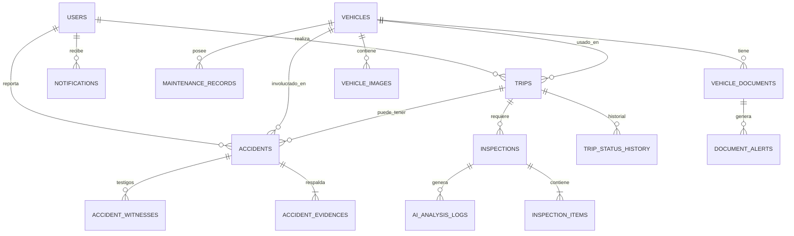

# 🚀 Opercheck - Arquitectura de Base de Datos

Opercheck es una plataforma inteligente para:

- Gestión de flotas
- Inspecciones preoperacionales
- Reportes de accidentes
- Gestión documental
- Mantenimiento preventivo
- Evidencia legal
- Análisis con IA

---

# 🧠 Arquitectura General

La base de datos fue diseñada en PostgreSQL utilizando un modelo relacional robusto y escalable.

Objetivos:

✅ Integridad de datos  
✅ Escalabilidad SaaS  
✅ Auditoría  
✅ Integración IA  
✅ Evidencia legal  
✅ Alto rendimiento  

---

# 🔗 Relación General de Tablas

---

# 👤 USERS

Guarda usuarios del sistema:

- Conductores
- Administradores
- Supervisores

## Relación

- Un usuario puede realizar muchos viajes
- Un usuario puede reportar muchos accidentes
- Un usuario puede recibir muchas notificaciones

---

# 🚗 VEHICLES

Guarda vehículos de la flota.

## Relación

- Un vehículo puede tener muchos viajes
- Un vehículo puede tener muchos accidentes
- Un vehículo puede tener múltiples mantenimientos
- Un vehículo puede tener muchos documentos

---

# 🛣️ TRIPS

Representa cada viaje realizado.

## Relación

- Pertenece a un conductor
- Pertenece a un vehículo
- Puede tener inspecciones
- Puede generar accidentes

---

# 🔍 INSPECTIONS

Guarda inspecciones pre y post viaje.

## Relación

- Pertenece a un viaje
- Tiene múltiples ítems inspeccionados
- Puede generar análisis IA

---

# 🧩 INSPECTION_ITEMS

Detalle individual de componentes revisados.

Ejemplos:
- Llantas
- Luces
- Frenos
- Motor

---

# 🤖 AI_ANALYSIS_LOGS

Historial de análisis realizados por IA.

Guarda:
- Prompt enviado
- Respuesta IA
- Modelo utilizado
- Nivel de confianza

---

# 🚨 ACCIDENTS

Reporte principal del accidente.

## Incluye:

- Conductor
- Vehículo
- Viaje
- GPS
- Severidad
- PDF legal

---

# 📸 ACCIDENT_EVIDENCES

Guarda evidencias del accidente.

## Tipos:

- Panorámica
- Daños
- Señales
- SOAT
- Licencia
- Placa

---

# 👥 ACCIDENT_WITNESSES

Guarda testigos.

Puede almacenar:
- nombre
- teléfono
- declaración
- audio

---

# 🔧 MAINTENANCE_RECORDS

Historial de mantenimientos.

## Ejemplos:

- Cambio aceite
- Frenos
- Motor
- Suspensión

---

# 📂 VEHICLE_DOCUMENTS

Documentación legal del vehículo.

## Tipos de documentos soportados

| Documento | Descripción |
|---|---|
| SOAT | Seguro obligatorio |
| TECNOMECANICA | Revisión técnico mecánica |
| POLIZA | Seguro todo riesgo |
| TARJETA_PROPIEDAD | Documento propiedad |
| TARJETA_OPERACION | Permiso operación |
| SEGURO_CONTRACTUAL | Transporte pasajeros |
| SEGURO_EXTRACONTRACTUAL | Cobertura adicional |

---

# ⚠️ DOCUMENT_ALERTS

Alertas automáticas.

Ejemplos:
- Documento vencido
- Próximo a vencer
- Documento faltante

---

# 🔔 NOTIFICATIONS

Sistema de notificaciones.

Ejemplos:
- Viaje iniciado
- Accidente reportado
- SOAT vencido
- Mantenimiento pendiente

---

# 🧠 Flujo Operativo General

## 1. Inicio Viaje

Conductor:
- inicia sesión
- selecciona vehículo
- realiza inspección

---

## 2. Inspección IA

Sistema:
- analiza imágenes
- calcula score
- genera PDF
- valida integridad SHA-256

---

## 3. Viaje

Sistema registra:
- tiempo
- kilometraje
- estados

---

## 4. Reporte Accidente

Conductor:
- toma fotos
- agrega evidencias
- registra testigos
- genera PDF legal

---

## 5. Finalización

Sistema:
- guarda KM final
- calcula mantenimiento
- genera alertas

---

# 🚀 Tecnologías Recomendadas

| Tecnología | Uso |
|---|---|
| PostgreSQL | Base de datos |
| FastAPI | Backend |
| SQLAlchemy | ORM |
| Google Cloud Storage | Archivos |
| Gemini AI | Análisis IA |
| Docker | Contenedores |
| Vercel | Frontend |
| Render | Backend |

---

# 🔐 Seguridad

Implementaciones recomendadas:

✅ JWT  
✅ Hash bcrypt  
✅ SHA-256 PDFs  
✅ Roles y permisos  
✅ Auditoría de cambios  

---

# 📈 Escalabilidad

Arquitectura preparada para:

- Multiempresa
- SaaS
- IA avanzada
- Analítica
- Mantenimiento predictivo